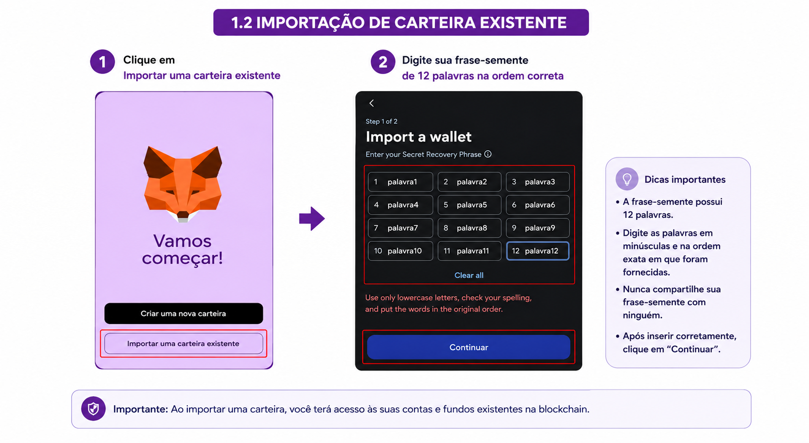
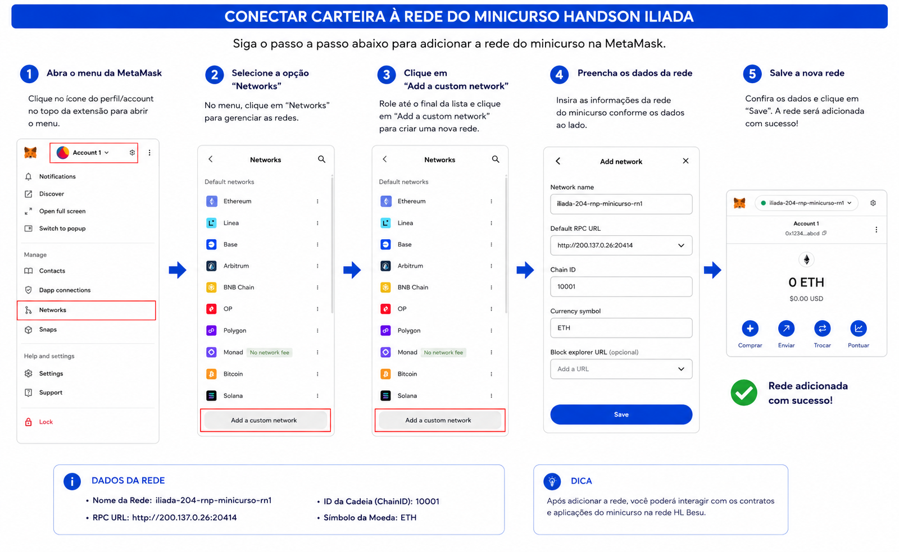
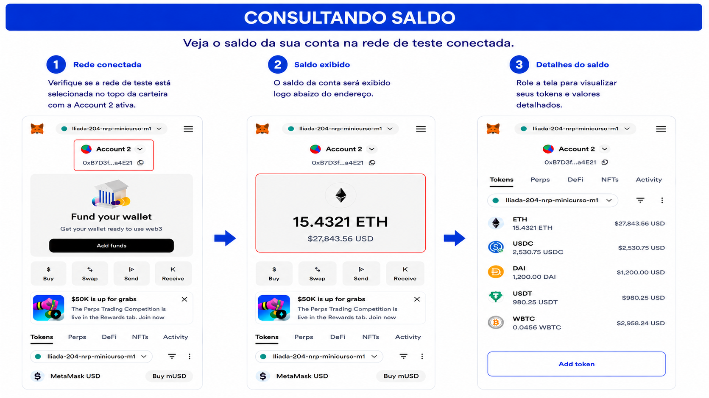
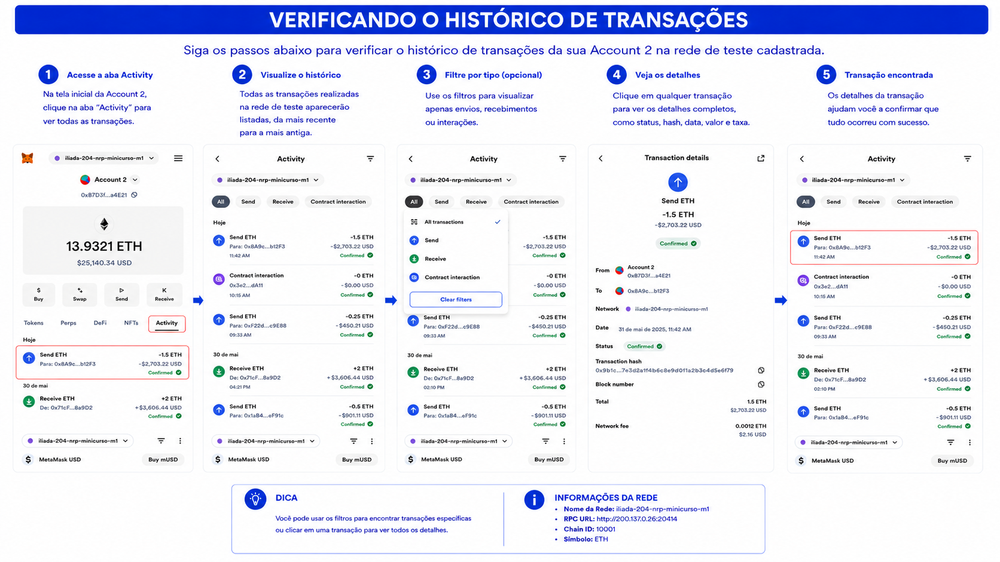

# MetaMask - Carteira Digital para Interação com a Rede Besu

# Visão Geral

A MetaMask é uma carteira digital de auto-custódia amplamente utilizada no ecossistema Web3. Ela permite armazenar chaves privadas, assinar transações e interagir com aplicações descentralizadas (DApps) em redes compatíveis com Ethereum Virtual Machine (EVM), incluindo Hyperledger Besu.

### Segurança e Recuperação

A criação da carteira é acompanhada da geração de uma frase-semente (Seed Phrase) composta por 12 palavras, utilizada para recuperação da conta em caso de perda do dispositivo. O acesso local à carteira é protegido por senha.

Além disso, a MetaMask oferece integração com hardware wallets, como Ledger e Trezor, proporcionando uma camada adicional de segurança.

### Auto-Custódia

A MetaMask opera no modelo de auto-custódia, no qual o próprio usuário mantém o controle de suas chaves privadas e ativos digitais, sem a necessidade de intermediários.

### Compatibilidade com Redes Blockchain

A carteira é compatível com diversas redes EVM, incluindo:

* Ethereum

* Hyperledger Besu

* Polygon

* Avalanche

* BNB Smart Chain

* Optimism

Novas redes podem ser adicionadas manualmente por meio de parâmetros como RPC URL e Chain ID.

### Gerenciamento de Contas

A MetaMask permite a criação de múltiplas contas e a importação de identidades blockchain por meio de:

* Chave privada;

* Arquivo JSON (Keystore).

### Transações e Ativos Digitais

A plataforma possibilita o envio e recebimento de:

* ETH;

* Tokens ERC-20;

* NFTs ERC-721;

* Tokens ERC-1155.

Também disponibiliza histórico detalhado de transações e acompanhamento do status das operações.

### Integração com Aplicações Web3


A MetaMask conecta-se diretamente a aplicações descentralizadas (DApps), permitindo autenticação, assinatura digital e execução de transações em redes blockchain.


### Disponibilidade

A carteira está disponível como:

* Extensão para Chrome, Firefox, Edge e Brave;

* Aplicativo móvel para Android e iOS.

## Fluxo de Utilização

```text
Usuário
 ↓
MetaMask
 ↓
RPC Besu
 ↓
Rede Blockchain
 ↓
Smart Contracts
```
---
## Objetivo

Nesta etapa você irá:
- Instalar a extensão MetaMask no Google Chrome;
- Criar ou importar uma carteira digital;
- Importar uma conta de teste;
- Conectar-se à rede Hyperledger Besu;
- Realizar transações;
- Interagir com Smart Contracts.

---

# 1. Instalação da Extensão

Acesse:

https://metamask.io/download

Selecione **Chrome** ou o navegador de sua escolha e clique em **Ex: Usar no chrome**.


Fixe a extensão no seu navegador para facilitar o acesso:


---

# 2. Criando uma Nova Carteira

- Clique em **Criar uma Nova Carteira**
- Defina uma senha
- Salve a frase-semente (Seed Phrase)

Ou importe uma carteira existente:

⚠️ Nunca compartilhe sua frase-semente.

Para criar uma nova carteira:


Para importar uma carteira existente:


---

# 3. Importando uma Conta de Teste

Menu:

```text
Contas
→ Importar Conta
```

Selecione **Chave Privada** e informe a chave criptografica da conta que deseja utilizar.


---

# 4. Adicionando a Rede Besu

Preencha os dados da rede:

| Campo | Valor |
|---------|---------|
| Nome da Rede | rede-besu |
| RPC URL | http://IP-DO-NODE:8545 |
| Chain ID | 10001 |
| Símbolo | ETH |

### Exemplo do Minicurso

| Campo | Valor |
|---------|---------|
| Nome da Rede | iliada-204-rnp-minicurso-rn1 |
| RPC URL | http://200.137.0.26:20414 |
| Chain ID | 10001 |
| Símbolo | ETH |


---

# 5. Conectando-se à Rede

```text
MetaMask
→ Selecionar Rede
→ iliada-besu
```


---

# 6. Consultando Saldo

Após conectar-se à rede, o saldo será exibido automaticamente.



---
# DESAFIO

# Importe uma nova conta (Passos 3 e 7)

Privete Key: 
Realize uma transação

# 7. Realizando uma Transação

- Clique em **Enviar**
- Informe o endereço de destino
- Informe a quantidade de ETH
- Confirme a transação


---

# 8. Histórico de Transações

A MetaMask permite visualizar:

- Transações enviadas
- Transações recebidas
- Operações pendentes
- Operações confirmadas



---
<!-- 
# 9. Interagindo com Smart Contracts

Fluxo:

```text
Remix
 ↓
MetaMask
 ↓
Rede Besu
```

A MetaMask será utilizada para assinar transações e executar funções do contrato.

> INSERIR IMAGEM: Interação com Smart Contract

---

# Resultado Esperado

Ao final desta atividade, o participante será capaz de:

- Criar e gerenciar uma carteira MetaMask;
- Conectar-se à rede Hyperledger Besu;
- Realizar transações;
- Consultar saldos;
- Interagir com Smart Contracts. -->
