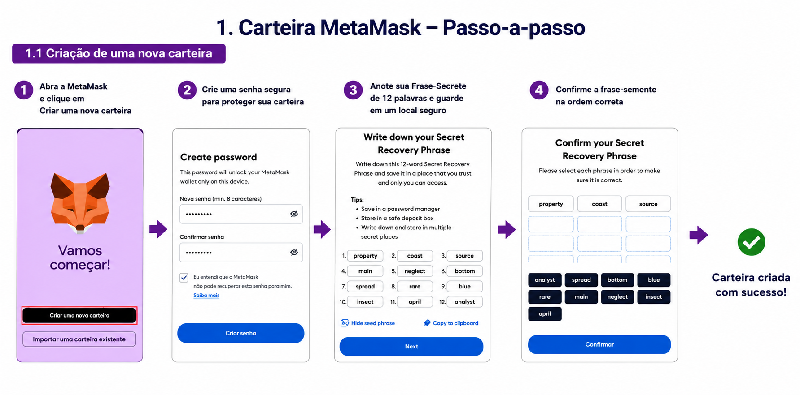
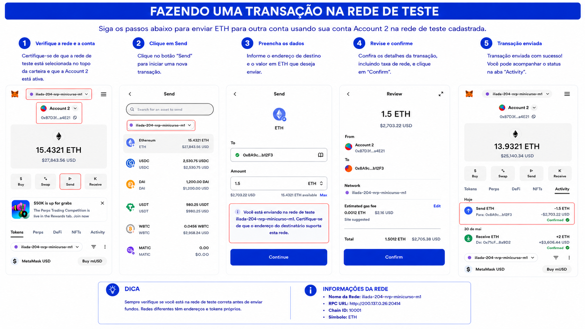

# MetaMask - Carteira Digital para Interação com a Rede Besu

# Visão Geral

A MetaMask é uma carteira digital compatível com redes baseadas em Ethereum Virtual Machine (EVM), como Ethereum, Hyperledger Besu, Polygon e BNB Smart Chain. Neste laboratório ela será utilizada para conectar-se à rede Besu, consultar saldos, realizar transações e interagir com Smart Contracts.

### Segurança e Recuperação

A criação da carteira gera uma frase-semente (*Seed Phrase*) composta por 12 palavras, utilizada para recuperação da conta em caso de perda do dispositivo. O acesso local à carteira é protegido por senha.

⚠️ Nunca compartilhe sua frase-semente ou suas chaves privadas.

### Fluxo de Utilização

```text
Usuário
 ↓
MetaMask
 ↓
RPC JSON-RPC
 ↓
Rede Hyperledger Besu
 ↓
Smart Contracts
```

---

## Objetivo

Nesta etapa você irá:

* Instalar a extensão MetaMask no Google Chrome;
* Criar ou importar uma carteira digital;
* Importar uma conta de teste;
* Conectar-se à rede Hyperledger Besu;
* Realizar transações;
* Interagir com Smart Contracts.

---

# 1. Instalação da Extensão

Acesse:

```text
https://metamask.io/download
```

Selecione **Chrome** (ou o navegador de sua preferência) e clique em **Add Extension**.


Fixe a extensão no navegador para facilitar o acesso:


---

# 2. Criando ou Importando uma Carteira

Ao abrir a MetaMask pela primeira vez, você poderá:

* Criar uma nova carteira;
* Importar uma carteira existente.

## Criar uma nova carteira

* Clique em **Criar uma Nova Carteira**;
* Defina uma senha;
* Salve sua frase-semente em local seguro.



## Importar uma carteira existente

Caso já possua uma carteira MetaMask, utilize a opção **Importar Carteira** e informe sua frase-semente.


---

# 3. Importando uma Conta de Teste

No menu da MetaMask, acesse:

```text
Contas
→ Importar Conta
```

Selecione a opção **Chave Privada** e informe a chave privada da conta que deseja importar.

### Exemplo

```text
0x8f2a55949038a9610f50fb23b5883af3b4ecb3c3bb792cbcefbd1542c692be63
```


---

# 4. Adicionando a Rede Besu

Preencha os dados da rede conforme os parâmetros disponibilizados pelo instrutor.

### Exemplo do Minicurso

| Campo        | Valor                        |
| ------------ | ---------------------------- |
| Nome da Rede | iliada-204-rnp-minicurso-rn1 |
| RPC URL      | http://200.137.0.26:20414    |
| Chain ID     | 10001                        |
| Símbolo      | ETH                          |


---

<!-- ## Troubleshooting de Conectividade RPC

A MetaMask não conseguiu conectar à rede Besu?

Valide a disponibilidade do serviço RPC executando os testes abaixo.

### 1. Dentro da máquina virtual

```bash
curl -X POST \
-H "Content-Type: application/json" \
-d '{"jsonrpc":"2.0","method":"web3_clientVersion","params":[],"id":1}' \
http://localhost:8545
```

### 2. No host físico que executa o Vagrant

```bash
curl -X POST \
-H "Content-Type: application/json" \
-d '{"jsonrpc":"2.0","method":"web3_clientVersion","params":[],"id":1}' \
http://localhost:20414
```

### 3. A partir de uma máquina externa

```bash
curl -X POST \
-H "Content-Type: application/json" \
-d '{"jsonrpc":"2.0","method":"web3_clientVersion","params":[],"id":1}' \
http://IP-PUBLICO:20414
```

Caso o terceiro teste não retorne uma resposta do Hyperledger Besu, verifique as configurações de firewall, redirecionamento de portas e conectividade de rede. -->

---

# 5. Conectando-se à Rede

Após adicionar a rede, selecione-a na MetaMask:

```text
MetaMask
→ Selecionar Rede
→ iliada-204-rnp-minicurso-rn1
```


---

# 6. Consultando Saldo

Após conectar-se à rede, o saldo da conta será exibido automaticamente na carteira.


---

# Desafio

## Importe uma nova conta e realize uma transação

Utilize o procedimento apresentado no passo 3 para importar uma nova conta por chave privada.

### Private Key

```text
0xc87509a1c067bbde78beb793e6fa76530b6382a4c0241e5e4a9ec0a0f44dc0d3
```

Após importar a conta:

1. Conecte-se à rede Besu;
2. Consulte o saldo disponível;
3. Realize uma transferência para outra conta do laboratório;
4. Verifique o resultado da operação no histórico da MetaMask.

---

# 7. Realizando uma Transação

* Clique em **Enviar**;
* Informe o endereço de destino;
* Defina a quantidade de ETH;
* Confirme a transação.

⚠️ Os ETH utilizados neste laboratório possuem finalidade exclusivamente educacional e não possuem valor financeiro.



---

# 8. Histórico de Transações

A MetaMask permite visualizar:

* Transações enviadas;
* Transações recebidas;
* Operações pendentes;
* Operações confirmadas.


---

# Resultado Esperado

Ao final desta atividade você deverá ser capaz de:

* Importar uma carteira na MetaMask;
* Importar contas por chave privada;
* Conectar-se a uma rede Hyperledger Besu;
* Consultar saldos;
* Enviar e receber transações;
* Acompanhar o histórico de operações na blockchain.
