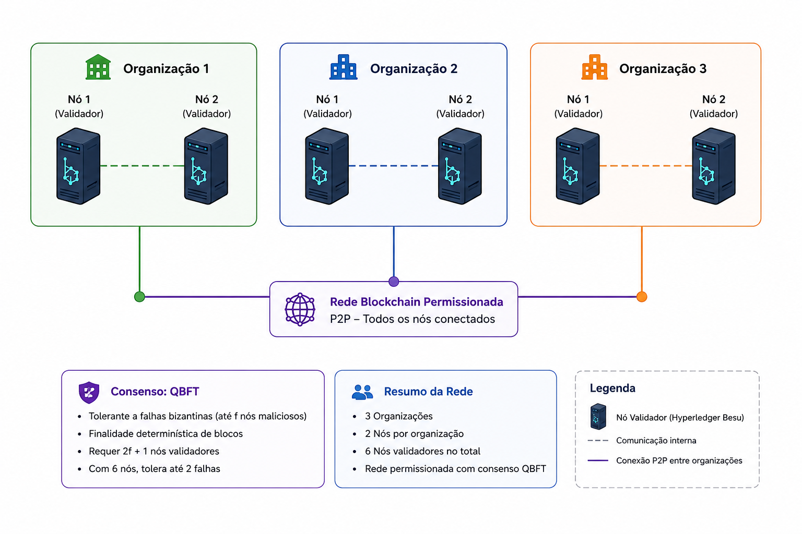

# Rede Blockchain Permissionada com Hyperledger Besu

## Objetivo

Neste laboratório será construída uma rede blockchain permissionada utilizando Hyperledger Besu e o consenso QBFT.



---

# 1. Instalar Requisitos

### 1.1 Aplicativos de Suporte

```bash
sudo apt install -y zip unzip
```

### 1.2. Instalação do Docker

```bash
sudo apt-get update
sudo apt-get install -y ca-certificates curl gnupg lsb-release
sudo mkdir -p /etc/apt/keyrings
curl -fsSL https://download.docker.com/linux/ubuntu/gpg | sudo gpg --dearmor -o /etc/apt/keyrings/docker.gpg
echo \
"deb [arch=$(dpkg --print-architecture) signed-by=/etc/apt/keyrings/docker.gpg] https://download.docker.com/linux/ubuntu \
$(lsb_release -cs) stable" | sudo tee /etc/apt/sources.list.d/docker.list > /dev/null
sudo apt-get update
sudo apt-get install -y docker-ce docker-ce-cli containerd.io docker-compose-plugin
```

Para confirma a correta instalação e versão do Docker

> [!IMPORTANT]
> 🚀 EXECUTE O COMANDO ABAIXO:

```bash
sudo docker run hello-world
docker --version
```

### 1.3. Docker Compose

```bash
sudo curl -L "https://github.com/docker/compose/releases/download/v2.20.3/docker-compose-linux-x86_64" -o docker-compose
sudo cp docker-compose /usr/bin/docker-compose
sudo chmod +x /usr/bin/docker-compose
```
Para confirma a correta instalação e versão do Docker Compose

> [!IMPORTANT]
> 🚀 EXECUTE O COMANDO ABAIXO:

```bash
docker-compose --version
```

### 1.4. Java 17

```bash
apt-cache search openjdk | grep openjdk-17
sudo apt install -y openjdk-17-jre
sudo apt install -y openjdk-17-jdk
```

Para confirma a correta instalação e versão do Java

> [!IMPORTANT]
> 🚀 EXECUTE O COMANDO ABAIXO:

```bash
java --version
```

```bash
export JAVA_HOME=/usr/lib/jvm/java-17-openjdk-amd64
export PATH=$JAVA_HOME/bin:$PATH
```

Para exibir o valor da variável de ambiente JAVA_HOME

> [!IMPORTANT]
> 🚀 EXECUTE O COMANDO ABAIXO:

```bash
echo $JAVA_HOME
```

### Disponibilizamos no diretório ~/iliada/ dois repositórios: rede-besu e rede-besu-aluno. Estes repositórios contém scripts de apoio para executar ações de configuração, verificação e execução da rede de forma otimizada. 

Para verificar se todos os pré-requisitos foram corretamente atendidos 
> [!IMPORTANT]
> 🚀 EXECUTE O SCRIPT:​
```bash
cd ~/iliada/rede-besu
./11-verificar-requisitos.sh​
```
---

# 2. Instalar os binários do Besu​

### 2.1 Criar pastas

```bash
cd ~/iliada
mkdir rede-besu
cd rede-besu
mkdir -p bin
mkdir -p config/besu
mkdir -p config/nodes
```

# 2.2 Download do Hyperledger Besu

```bash
cd ~/iliada/rede-besu/bin
curl -L https://github.com/hyperledger/besu/releases/download/24.5.4/besu-24.5.4.zip -o besu-24.5.4.zip
unzip besu-24.5.4.zip
```

Para acessar o repositório de instalação dos binários do Besu:


> [!IMPORTANT]
> 🚀 EXECUTE O COMANDO ABAIXO:

```bash
cd ~/iliada/rede-besu/bin
```
Para verificar versão instalada e os parâmetros disponíveis (besu [OPTIONS])

> [!IMPORTANT]
> 🚀 EXECUTE O COMANDO ABAIXO:

```bash
besu-24.5.4/bin/besu --version
besu-24.5.4/bin/besu --help
```
---

# 3. Gerar as chaves criptográficas dos nodes

Configure as variáveis de ambiente:

> [!IMPORTANT]
> 🚀 EXECUTE O COMANDO ABAIXO:

```bash
BASEDIR=/home/iliada/iliada/rede-besu
CONFIGDIR=/home/iliada/iliada/rede-besu/config
cd $BASEDIR/bin
```
As chaves criptográficas dos validadores da rede já foram previamente geradas para este laboratório. Entretanto, caso fosse necessário criá-las manualmente, os seguintes comandos poderiam ser utilizados:

## Org1 Node1

```bash
mkdir $CONFIGDIR/nodes/org1-node1
besu-24.5.4/bin/besu --data-path=$CONFIGDIR/nodes/org1-node1 public-key export --to=$CONFIGDIR/nodes/org1-node1/key.pub
besu-24.5.4/bin/besu --data-path=$CONFIGDIR/nodes/org1-node1 public-key export-address --to=$CONFIGDIR/nodes/org1-node1/node.id
```

## Org1 Node2

```bash
mkdir $CONFIGDIR/nodes/org1-node2
besu-24.5.4/bin/besu --data-path=$CONFIGDIR/nodes/org1-node2 public-key export --to=$CONFIGDIR/nodes/org1-node2/key.pub
besu-24.5.4/bin/besu --data-path=$CONFIGDIR/nodes/org1-node2 public-key export-address --to=$CONFIGDIR/nodes/org1-node2/node.id
```

## Org2 Node1

```bash
mkdir $CONFIGDIR/nodes/org2-node1
besu-24.5.4/bin/besu --data-path=$CONFIGDIR/nodes/org2-node1 public-key export --to=$CONFIGDIR/nodes/org2-node1/key.pub
besu-24.5.4/bin/besu --data-path=$CONFIGDIR/nodes/org2-node1 public-key export-address --to=$CONFIGDIR/nodes/org2-node1/node.id
```

## Org2 Node2

```bash
mkdir $CONFIGDIR/nodes/org2-node2
besu-24.5.4/bin/besu --data-path=$CONFIGDIR/nodes/org2-node2 public-key export --to=$CONFIGDIR/nodes/org2-node2/key.pub
besu-24.5.4/bin/besu --data-path=$CONFIGDIR/nodes/org2-node2 public-key export-address --to=$CONFIGDIR/nodes/org2-node2/node.id
```

## Org3 Node1

```bash
mkdir $CONFIGDIR/nodes/org3-node1
besu-24.5.4/bin/besu --data-path=$CONFIGDIR/nodes/org3-node1 public-key export --to=$CONFIGDIR/nodes/org3-node1/key.pub
besu-24.5.4/bin/besu --data-path=$CONFIGDIR/nodes/org3-node1 public-key export-address --to=$CONFIGDIR/nodes/org3-node1/node.id
```

## Org3 Node2

```bash
mkdir $CONFIGDIR/nodes/org3-node2
besu-24.5.4/bin/besu --data-path=$CONFIGDIR/nodes/org3-node2 public-key export --to=$CONFIGDIR/nodes/org3-node2/key.pub
besu-24.5.4/bin/besu --data-path=$CONFIGDIR/nodes/org3-node2 public-key export-address --to=$CONFIGDIR/nodes/org3-node2/node.id
```

Para verificar o material criptográfico gerado para cada node​

> [!IMPORTANT]
> 🚀 EXECUTE O COMANDO ABAIXO:

```bash
cd $BASEDIR
./13-verificar-chaves-nodes.sh
```

<!-- > Espaço para imagem: Estrutura de validadores -->

---

# 4. Gerar arquivos de configuração dos nodes

Cada organização terá um arquivo docker-compose:

Exemplo Org1:
```bash
  logging: &logging-default
    options:
      max-size: '10m'
      max-file: '5'
    driver: json-file

  localization: &localization-default
    TZ: America/Sao_Paulo
    LANG: en_US.UTF-8

services:
  org1-node1:
    image: hyperledger/besu:24.5.4
    logging: *logging-default
    restart: unless-stopped
    environment:
      <<: *localization-default
      LOG4J_CONFIGURATION_FILE: "/var/lib/besu/log.xml"
      BESU_DATA_PATH: "/var/lib/besu"
      BESU_GENESIS_FILE: "/var/lib/besu/genesis.json"
      BESU_MAX_PEERS: "50"
      BESU_REMOTE_CONNECTIONS_LIMIT_ENABLED: "false"
      BESU_MIN_GAS_PRICE: "0"
      BESU_HOST_ALLOWLIST: "*"
      BESU_RPC_HTTP_ENABLED: "true"
      BESU_RPC_HTTP_HOST: "0.0.0.0"
      BESU_RPC_HTTP_PORT: "8545"
      BESU_RPC_HTTP_API: "ADMIN,ETH,TXPOOL,NET,QBFT,WEB3,DEBUG,TRACE,PERM"
      BESU_RPC_HTTP_CORS_ORIGINS: "*"
      BESU_RPC_MAX_RANGE_LOGS: "500000"
      BESU_METRICS_ENABLED: "true"
      BESU_METRICS_HOST: "0.0.0.0"
      BESU_METRICS_PORT: "9545"
      BESU_P2P_HOST: "0.0.0.0"
      BESU_P2P_PORT: "30301"
    user: "0"
    command: >-
      --Xdns-enabled=true
      --Xdns-update-enabled=true
      --rpc-http-port=8545
      --logging=DEBUG
    volumes:
      - /home/iliada/iliada/rede-besu/volumes/org1-node1/:/var/lib/besu/
      - /home/iliada/iliada/rede-besu/config/nodes/org1-node1/key:/var/lib/besu/key
      - /home/iliada/iliada/rede-besu/config/besu/log.xml:/var/lib/besu/log.xml
      - /home/iliada/iliada/rede-besu/config/besu/genesis.json:/var/lib/besu/genesis.json
      - /home/iliada/iliada/rede-besu/config/besu/static-nodes.json:/var/lib/besu/static-nodes.json
    ports:
      - 30301:30301
      - 8545:8545
      - 9545:9545
```

Criar os arquivos:

```bash
nano $CONFIGDIR/nodes/org1-node1/docker-compose.yml
nano $CONFIGDIR/nodes/org1-node2/docker-compose.yml
nano $CONFIGDIR/nodes/org2-node1/docker-compose.yml
nano $CONFIGDIR/nodes/org2-node2/docker-compose.yml
nano $CONFIGDIR/nodes/org3-node1/docker-compose.yml
nano $CONFIGDIR/nodes/org3-node2/docker-compose.yml
```

Para conferir o arquivo docker-compose.yml de qualquer node apenas substitua o numero da organização e node no comando abaixo

> [!IMPORTANT]
> 🚀 EXECUTE O COMANDO ABAIXO:
```bash
cat $CONFIGDIR/nodes/org1-node1/docker-compose.yml
```
Ou verifique todas as configurações com o script:

> [!IMPORTANT]
> 🚀 EXECUTE O COMANDO ABAIXO

```bash
./14-verificar-config-nodes.sh
```

Após validar que a configuração dos nós foi criada corretamente, execute o script abaixo. Ele será responsável por atualizar o arquivo `static-nodes.json`, que contém as informações necessárias para que os nós validadores iniciais da rede se descubram e estabeleçam conexão automaticamente. Dessa forma, os validadores passarão a se comunicar entre si sem a necessidade de configurações adicionais, comandos manuais ou processos de votação.


> [!IMPORTANT]
> 🚀 EXECUTE O COMANDO ABAIXO

```bash
./03-gerar-static-nodes.sh
```

# 5. Gerar os arquivos de configuração da rede Besu

O genesis.json tem um campo chamado “extraData” contendo o conjunto de validadores iniciais da rede codificado em uma string, gerada a partir de um arquivo json com os nodeid’s de cada node.

## 5.1 initialValidators.json

O arquivo initialValidators.json contém os node.id de todos os validadores iniciais da rede, utilizados pelo consenso QBFT para definir os nós autorizados a participar da validação de blocos desde a inicialização da blockchain.

Acesse o diretório:
> [!IMPORTANT]
> 🚀 EXECUTE O COMANDO ABAIXO:

```bash
cd $CONFIGDIR/besu/
```

```bash
nano initialValidators.json
```

Para visualizar o Validadores inicias definidos na rede

> [!IMPORTANT]
> 🚀 EXECUTE O COMANDO ABAIXO

```bash
cat initialValidators.json
```

## 5.2 extraData.json
Geração da string codificada que preenche o campo de validadores inicias da rede no arquivo de configuração genesis.json

```bash
(../../bin/besu-24.5.4/bin/besu rlp encode --from=initialValidators.json --type=QBFT_EXTRA_DATA) > extraData.json
```
Para conferir o valor de extraData

> [!IMPORTANT]
> 🚀 EXECUTE O COMANDO ABAIXO
```bash
cat extraData.json
```

## 5.3 genesis.json
O arquivo genesis.json é o arquivo responsável por definir a configuração inicial da blockchain. Ele contém parâmetros fundamentais da rede, como o mecanismo de consenso (QBFT), os validadores iniciais, o identificador da rede (chainId), regras de protocolo e o estado inicial do ledger. Todos os nós da rede devem utilizar exatamente o mesmo arquivo genesis.json, pois qualquer divergência resultará na criação de uma blockchain diferente e incompatível com os demais participantes.
```bash
nano $CONFIGDIR/besu/genesis.json
```
Modelo genesis.json utilizado neste roteiro:

```bash
{
  "config" : {
    "chainId" : 10001,
    "homesteadBlock": 0,
    "daoForkBlock": 0,
    "eip150Block": 0,
    "eip155Block": 0,
    "eip158Block": 0,
    "byzantiumBlock": 0,
    "constantinopleBlock": 0,
    "constantinoplefixblock" : 0,
    "muirGlacierBlock": 0,
    "berlinBlock": 0,
    "londonBlock": 0,
    "arrowGlacierBlock": 0,
    "grayGlacierBlock": 0,
    "zeroBaseFee": true,
    "contractSizeLimit": 2147483647,
    "qbft": {
      "epochlength": 30000,
      "blockperiodseconds": 4,
      "requesttimeoutseconds": 8
    },
    "discovery": {
      "bootnodes": []
    }
  },
  "nonce": "0x0",
  "gasLimit": "0xF42400",
  "difficulty": "0x1",
  "mixHash": "0x63746963616c2062797a616e74696e65206661756c7420746f6c6572616e6365",
  "extraData": "0xf8a4a00000000000000000000000000000000000000000000000000000000000000000f87e943b297c40878aa9c3966616e55ddba53721f4bb7094ed0bcd9b168265bf5b04a69fa4a84e418d9e868894ca06e60f8cfad545b4b21872a53f0a456255a71d9435b9fa70871580c91a016474c4b47de7b281a05994d01d51fbfc31b3c4eac088e8204f6e644306152e9474c2ca3816b981d95f2e4f0078b9e38639f74673c080c0",
  "coinbase": "0x0000000000000000000000000000000000000000",
  "alloc": {
    "0xfe3b557e8fb62b89f4916b721be55ceb828dbd73": {
      "privateKey": "0x8f2a55949038a9610f50fb23b5883af3b4ecb3c3bb792cbcefbd1542c692be63",
      "comment": "private key and this comment are ignored.  In a real chain, the private key should NOT be stored",
      "balance": "100000000000000000000"
    },
    "0x627306090abaB3A6e1400e9345bC60c78a8BEf57": {
      "privateKey": "0xc87509a1c067bbde78beb793e6fa76530b6382a4c0241e5e4a9ec0a0f44dc0d3",
      "comment": "private key and this comment are ignored.  In a real chain, the private key should NOT be stored",
      "balance": "200000000000000000000"
    },
    "0xf17f52151EbEF6C7334FAD080c5704D77216b732": {
      "privateKey": "0xae6ae8e5ccbfb04590405997ee2d52d2b330726137b875053c36d94e974d162f",
      "comment": "private key and this comment are ignored.  In a real chain, the private key should NOT be stored",
      "balance": "300000000000000000000"
    },
    "f39fd6e51aad88f6f4ce6ab8827279cfffb92266": {
      "privateKey": "0xac0974bec39a17e36ba4a6b4d238ff944bacb478cbed5efcae784d7bf4f2ff80",
      "comment": "private key and this comment are ignored.  In a real chain, the private key should NOT be stored",
      "balance": "400000000000000000000"
    }
  },
  "timestamp": "0x65dca409"
}

```
Para conferir o arquivo genesis.json 

> [!IMPORTANT]
> 🚀 EXECUTE O COMANDO ABAIXO
```bash
cat $CONFIGDIR/besu/genesis.json
```

Ou o script:

```bash
cd $BASEDIR
./15-verificar-config-besu.sh
```
Mais informações em:​

##### [Arquivo Genesis (Hyperledger Besu)](https://besu.hyperledger.org/public-networks/concepts/genesis-file)
---

# 6. Configuração do arquivo de Log XML

O arquivo log.xml define como o Hyperledger Besu registra eventos e mensagens de execução. Neste laboratório, ele configura a exibição de logs no console e o armazenamento em arquivos separados por nível (INFO, ERROR e DEBUG). Além disso, implementa rotação automática dos arquivos quando atingem 10 MB e remove logs com mais de 30 dias, facilitando o monitoramento e evitando o crescimento excessivo do espaço utilizado em disco.

```bash
nano $CONFIGDIR/nodes/org1-node1/log.xml
cat $CONFIGDIR/nodes/org1-node1/log.xml
```

Arquivo de configuração de Log utilizado neste laboratório:
```bash
<?xml version="1.0" encoding="UTF-8"?>
<Configuration status="INFO">
    <Properties>
        <Property name="root.log.level">INFO</Property>
        <Property name="LOG_PATTERN">%d{yyyy-MM-dd'T'HH:mm:ss.SSSZ} %p %m%n</Property>
        <Property name="LOG_BASE_PATH">/var/lib/besu/logs</Property>
    </Properties>
    <Appenders>
        <Console name="infoConsole" target="SYSTEM_OUT">
            <LevelRangeFilter minLevel="INFO" maxLevel="INFO" onMatch="ACCEPT" onMismatch="DENY" />
            <PatternLayout pattern="${LOG_PATTERN}" />
        </Console>

        <Console name="errorConsole" target="SYSTEM_ERR">
            <LevelRangeFilter minLevel="ERROR" maxLevel="ERROR" onMatch="ACCEPT" onMismatch="DENY" />
            <PatternLayout pattern="${LOG_PATTERN}" />
        </Console>

        <RollingFile name="infoLog" fileName="${LOG_BASE_PATH}/besu_info.log" filePattern="${LOG_BASE_PATH}/$${date:yyyy-MM}_info/app-%d{MM-dd-yyyy}-%i.log">
            <LevelRangeFilter minLevel="INFO" maxLevel="INFO" onMatch="ACCEPT" onMismatch="DENY" />
            <PatternLayout pattern="${LOG_PATTERN}" />
            <Policies>
                <SizeBasedTriggeringPolicy size="10 MB" />
            </Policies>
            <DefaultRolloverStrategy>
                <Delete basePath="${LOG_BASE_PATH}" maxDepth="2">
                    <IfFileName glob="*_info/app-*.log" />
                    <IfLastModified age="30d" />
                </Delete>
            </DefaultRolloverStrategy>
        </RollingFile>

        <RollingFile name="errorLog" fileName="${LOG_BASE_PATH}/besu_error.log" filePattern="${LOG_BASE_PATH}/$${date:yyyy-MM}_error/app-%d{MM-dd-yyyy}-%i.log">
            <LevelRangeFilter minLevel="ERROR" maxLevel="ERROR" onMatch="ACCEPT" onMismatch="DENY" />
            <PatternLayout pattern="${LOG_PATTERN}" />
            <Policies>
                <SizeBasedTriggeringPolicy size="10 MB" />
            </Policies>
            <DefaultRolloverStrategy>
                <Delete basePath="${LOG_BASE_PATH}" maxDepth="2">
                    <IfFileName glob="*_error/app-*.log" />
                    <IfLastModified age="30d" />
                </Delete>
            </DefaultRolloverStrategy>
        </RollingFile>

        <RollingFile name="debugLog" fileName="${LOG_BASE_PATH}/besu_debug.log" filePattern="${LOG_BASE_PATH}/$${date:yyyy-MM}_debug/app-%d{MM-dd-yyyy}-%i.log">
            <LevelRangeFilter minLevel="DEBUG" maxLevel="DEBUG" onMatch="ACCEPT" onMismatch="DENY" />
            <PatternLayout pattern="${LOG_PATTERN}" />
            <Policies>
                <SizeBasedTriggeringPolicy size="10 MB" />
            </Policies>
            <DefaultRolloverStrategy>
                <Delete basePath="${LOG_BASE_PATH}" maxDepth="2">
                    <IfFileName glob="*_debug/app-*.log" />
                    <IfLastModified age="30d" />
                </Delete>
            </DefaultRolloverStrategy>
        </RollingFile>

    </Appenders>
    <Loggers>
        <Root level="all">
            <AppenderRef ref="infoConsole" />
            <AppenderRef ref="errorConsole" />
            <AppenderRef ref="infoLog" />
            <AppenderRef ref="errorLog" />
            <AppenderRef ref="debugLog" />
        </Root>
    </Loggers>
</Configuration>
```


---

# 7. Criação de Volumes
Os volumes são utilizados para armazenar de forma persistente os dados de cada nó da rede blockchain. Isso garante que informações importantes, como blocos, estado da blockchain, chaves e configurações locais, sejam preservadas mesmo que os contêineres sejam reiniciados, removidos ou atualizados.


```bash
BASEDIR=/home/iliada/iliada/rede-besu

mkdir -p $BASEDIR/volumes/org1-node1
mkdir -p $BASEDIR/volumes/org1-node2
mkdir -p $BASEDIR/volumes/org2-node1
mkdir -p $BASEDIR/volumes/org2-node2
mkdir -p $BASEDIR/volumes/org3-node1
mkdir -p $BASEDIR/volumes/org3-node2
```

Para verificar se todos os volumes foram devidamente criados:

> [!IMPORTANT]
> 🚀 EXECUTE O COMANDO ABAIXO

```bash
ll $BASEDIR/volumes
```

---

# 8. Inicialização dos Nós

Nesta etapa, iremos utilizar os arquivos docker-compose.yml de cada node para iniciar a rede.

Iremos primeiro executar dois nós da rede a observar o log (Observe que um peer é adicionado ao log na segunda execução):

Executar para cada nó:
> [!IMPORTANT]
> 🚀 EXECUTE O COMANDO ABAIXO:
```bash
cd $CONFIGDIR/nodes/org1-node1
docker-compose up -d
docker-compose logs -f
```
Para sair da visualização do log:
[Ctrl+C]

> [!IMPORTANT]
> 🚀 EXECUTE O COMANDO ABAIXO
```bash
cd $CONFIGDIR/nodes/org2-node2
docker-compose up -d
docker-compose logs -f
```
Para sair da visualização do log:
[Ctrl+C]

Agora iremos remover o nodes criados e inciar a rede COMPLETA com o 6 nodes, utilizando o script abaixo:

> [!IMPORTANT]
> 🚀 EXECUTE O COMANDO ABAIXO
```bash
cd $BASEDIR
./23-remover-nodes-e-volumes.sh
```

> [!IMPORTANT]
> 🚀 EXECUTE O COMANDO ABAIXO
```bash
cd $BASEDIR
./21-iniciar-nodes.sh
```

---

# 9. Validação e Interação com a Rede

## Chain ID

```bash
curl -d "{\"jsonrpc\": \"2.0\", \"method\": \"eth_chainId\", \"params\": [], \"id\": 1 }" http://localhost:8545
```

## Block Number

```bash
curl -d "{\"jsonrpc\": \"2.0\", \"method\": \"eth_blockNumber\", \"params\": [], \"id\": 1 }" http://localhost:8545
```

## Signer Metrics

```bash
curl -d "{\"jsonrpc\": \"2.0\", \"method\": \"qbft_getSignerMetrics\", \"params\": [\"earliest\", \"latest\"], \"id\": 1 }" http://localhost:8545
```

---

# 10. Métricas Prometheus - Monitoramento

```bash
curl http://localhost:9545/metrics
```

> Espaço para imagem: Métricas exportadas pelo Besu

---

# Fim do Laboratório

Parabéns! Sua rede blockchain permissionada baseada em Hyperledger Besu e QBFT está operacional.
