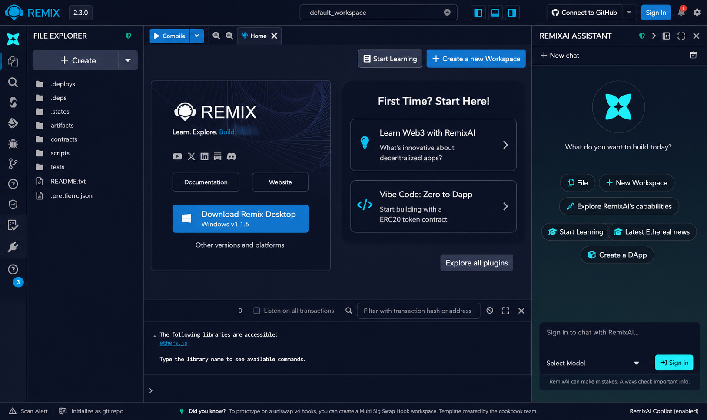
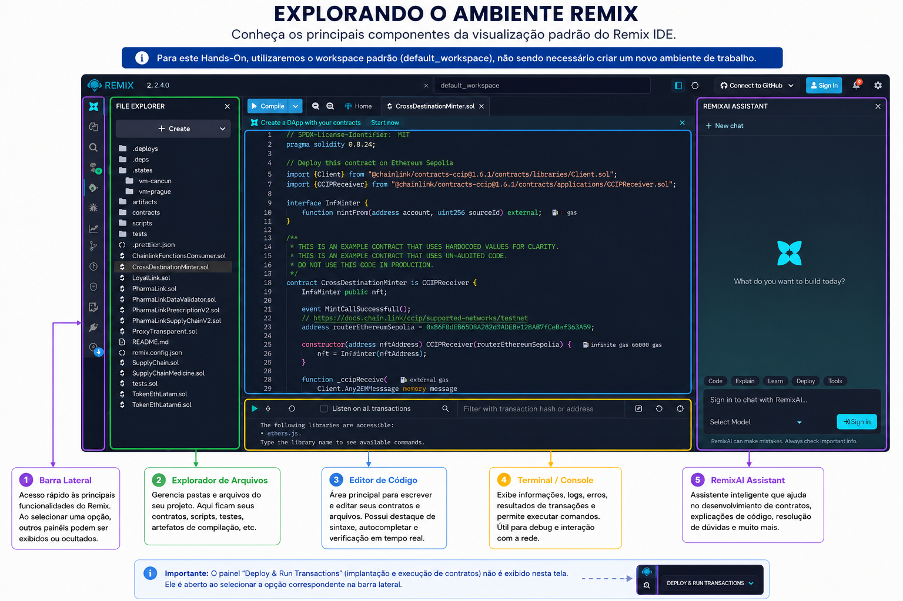
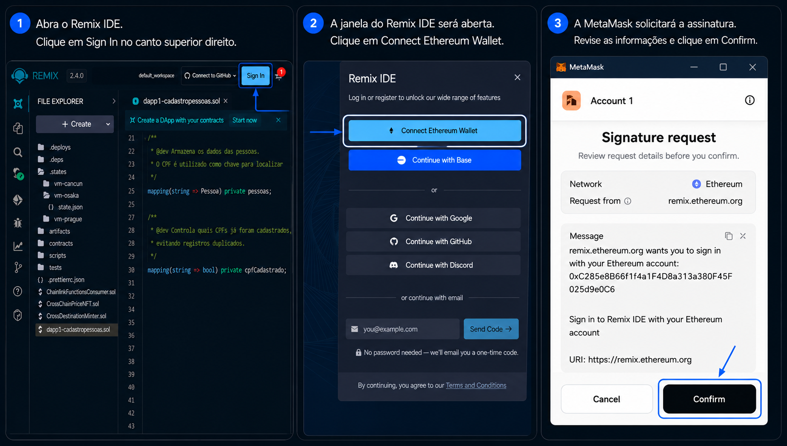
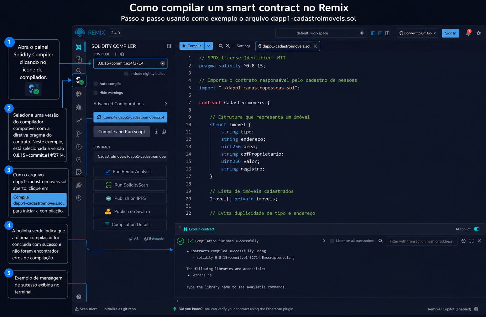
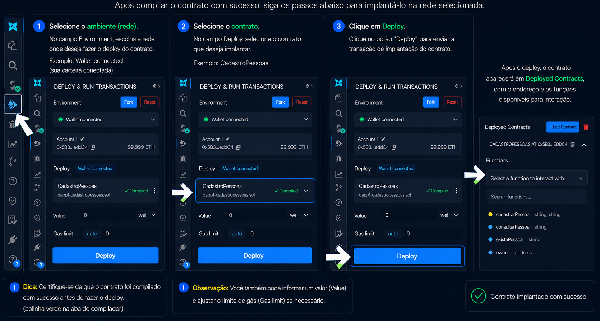
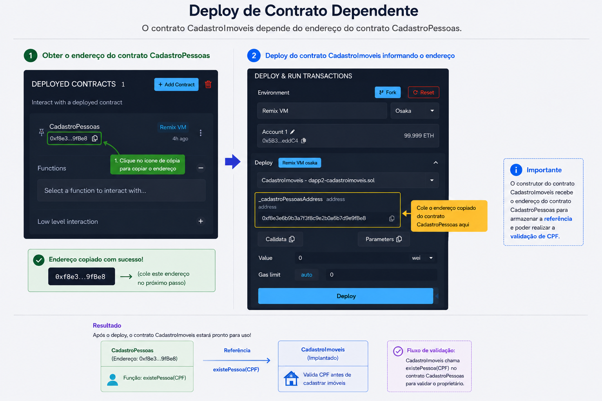
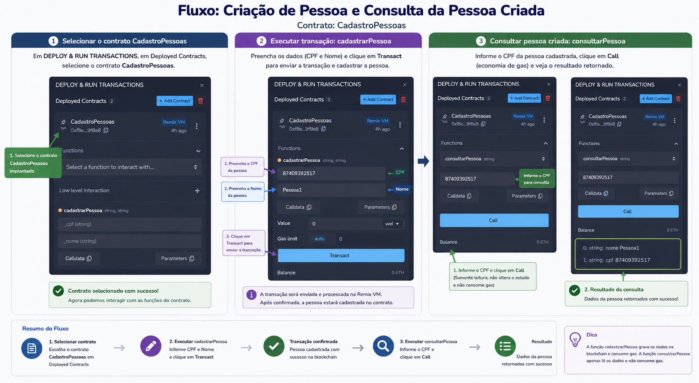
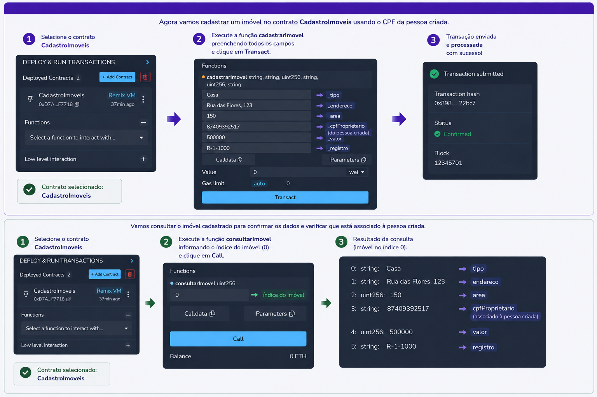

# Hands-On Hyperledger Besu - Remix IDE

## Visão Geral do Remix IDE

O Remix IDE é um ambiente de desenvolvimento integrado (IDE) baseado em navegador, amplamente utilizado para criar, testar, implantar e interagir com contratos inteligentes compatíveis com a Ethereum Virtual Machine (EVM). Por funcionar diretamente no navegador, o Remix elimina a necessidade de instalações complexas e oferece uma forma rápida e prática de iniciar o desenvolvimento em blockchain.

A ferramenta possui suporte nativo à linguagem Solidity, permitindo escrever contratos inteligentes, compilá-los, executar testes e realizar implantações em redes locais, públicas ou permissionadas, como o Hyperledger Besu. Além disso, integra-se diretamente com carteiras digitais como a MetaMask, possibilitando a assinatura de transações e a interação com contratos implantados em redes blockchain reais.

Durante este Hands-On, o Remix será utilizado para desenvolver e implantar contratos inteligentes na rede Hyperledger Besu do minicurso, permitindo que os participantes experimentem todo o ciclo de desenvolvimento de aplicações blockchain: criação do contrato, compilação, implantação, execução de transações e consulta dos resultados registrados na rede.

Principais funcionalidades do Remix:

- Desenvolvimento de contratos inteligentes em Solidity;
- Compilação automática e análise de código;
- Implantação em redes Ethereum e Hyperledger Besu;
- Integração direta com MetaMask;
- Execução de transações e chamadas de funções;
- Visualização de logs, eventos e resultados;
- Ambiente totalmente web, sem necessidade de instalação.

Em resumo, o Remix IDE funciona como uma plataforma completa para desenvolvimento e experimentação de aplicações blockchain, sendo uma das ferramentas mais utilizadas para aprendizado, prototipação e testes de contratos inteligentes compatíveis com EVM.

## Objetivo

Neste roteiro você irá conectar a MetaMask à rede do minicurso, criar um contrato no Remix, realizar o deploy na rede Hyperledger Besu e executar transações utilizando a **Account** criada anteriormente.

---

# 1. Acessando o Remix IDE

## 1.1 Home Remix

Acesse:

https://remix.ethereum.org



## 1.2 Explorando o ambiente remix



---

# 2. Conecte a carteira MetaMask ao Remix

Nesta etapa, iremos conectar o Remix à carteira Metamask utilizando uma das contas disponíveis para realizar Deploys de contratos e transações.



---

# 3. Criando o contrato CadastroPessoas

Crie seu primeiro contrato.

- O contrato inteligente CadastroPessoas implementa um sistema simples de cadastro e consulta de pessoas em uma rede blockchain compatível com a Ethereum Virtual Machine (EVM). 

- Cada pessoa é identificada de forma única por seu CPF, que é utilizado como chave de acesso aos dados armazenados. 

- O contrato restringe a inclusão de novos registros ao proprietário do contrato (owner), garantindo controle sobre as operações de escrita. 

- Disponibiliza funções para consultar dados cadastrados e verificar a existência de um CPF na base de registros.

- Todas as inclusões geram um evento em blockchain, permitindo auditoria e rastreabilidade das operações realizadas.

Arquivo:

```text
contracts/dapp1-cadastropessoas.sol
```

```solidity
// SPDX-License-Identifier: MIT
pragma solidity ^0.8.15;

/**
 * @title CadastroPessoas
 * @dev Contrato para cadastro e consulta de pessoas utilizando CPF como identificador único.
 */
contract CadastroPessoas {

    /**
     * @dev Estrutura que representa uma pessoa.
     */
    struct Pessoa {
        string nome;
        string cpf;
    }

    /// Endereço do proprietário do contrato
    address public owner;

    /**
     * @dev Armazena os dados das pessoas.
     * O CPF é utilizado como chave para localizar os registros.
     */
    mapping(string => Pessoa) private pessoas;

    /**
     * @dev Controla quais CPFs já foram cadastrados,
     * evitando registros duplicados.
     */
    mapping(string => bool) private cpfCadastrado;

    /**
     * @dev Evento emitido sempre que uma nova pessoa é cadastrada.
     */
    event PessoaCadastrada(string cpf, string nome);

    /**
     * @dev Executado apenas uma vez no momento da implantação.
     * Define o criador do contrato como proprietário.
     */
    constructor() {
        owner = msg.sender;
    }

    /**
     * @dev Modificador que restringe o acesso
     * apenas ao proprietário do contrato.
     */
    modifier onlyOwner() {
        require(
            msg.sender == owner,
            "Apenas o dono pode executar esta acao"
        );
        _;
    }

    /**
     * @dev Cadastra uma nova pessoa.
     * Apenas o proprietário pode executar esta função.
     *
     * @param _cpf CPF da pessoa.
     * @param _nome Nome da pessoa.
     */
    function cadastrarPessoa(
        string memory _cpf,
        string memory _nome
    ) public onlyOwner {

        // Impede o cadastro de CPFs já existentes
        require(
            !cpfCadastrado[_cpf],
            "CPF ja cadastrado"
        );

        // Armazena os dados da pessoa
        pessoas[_cpf] = Pessoa(_nome, _cpf);

        // Marca o CPF como cadastrado
        cpfCadastrado[_cpf] = true;

        // Registra o evento na blockchain
        emit PessoaCadastrada(_cpf, _nome);
    }

    /**
     * @dev Consulta os dados de uma pessoa pelo CPF.
     *
     * @param _cpf CPF da pessoa.
     * @return nome Nome da pessoa.
     * @return cpf CPF da pessoa.
     */
    function consultarPessoa(
        string memory _cpf
    )
        public
        view
        returns (
            string memory nome,
            string memory cpf
        )
    {
        // Verifica se o CPF existe
        require(
            cpfCadastrado[_cpf],
            "CPF nao encontrado"
        );

        Pessoa memory p = pessoas[_cpf];

        return (p.nome, p.cpf);
    }

    /**
     * @dev Verifica se um CPF já está cadastrado.
     *
     * @param _cpf CPF a ser consultado.
     * @return true se existir, false caso contrário.
     */
    function existePessoa(
        string memory _cpf
    )
        public
        view
        returns (bool)
    {
        return cpfCadastrado[_cpf];
    }
}
```

---

# 4. Compilando o Contrato

```text
Selecione o compilador na versão compatível com o seu contrato.
Ex: Compiler: 0.8.24
```

Clique em "Compile":

```text
dapp1-cadastropessoas.sol
```




---

# 5. Faça o deploy do contrato na rede blockchain.



# 6. Crie e Compile o Contrato CadastroImoveis

Se necessário, volte às etapas 3 e 4 para relembrar como criar e compilar um novo contrato.

- O contrato CadastroImoveis permite registrar e consultar imóveis em blockchain.
- Antes de cadastrar um imóvel, o contrato consulta o contrato CadastroPessoas para verificar se o CPF informado como proprietário já está cadastrado. 
- É garantido que todo imóvel esteja associado a uma pessoa previamente registrada, promovendo integridade e consistência dos dados armazenados.

>
```solidity
// SPDX-License-Identifier: MIT
pragma solidity ^0.8.15;

// Importa o contrato responsável pelo cadastro de pessoas
import "./dapp1-cadastropessoas.sol";

contract CadastroImoveis {

    // Estrutura que representa um imóvel
    struct Imovel {
        string tipo;
        string endereco;
        uint256 area;
        string cpfProprietario;
        uint256 valor;
        string registro;
    }

    // Lista de imóveis cadastrados
    Imovel[] private imoveis;

    // Evita duplicidade de tipo e endereço
    mapping(string => bool) private tipoUsado;
    mapping(string => bool) private enderecoUsado;

    // Dono do contrato
    address public owner;

    // Referência ao contrato CadastroPessoas
    CadastroPessoas public cadastroPessoas;

    // Recebe o endereço do contrato CadastroPessoas
    constructor(address _cadastroPessoasAddress) {
        owner = msg.sender;
        cadastroPessoas = CadastroPessoas(_cadastroPessoasAddress);
    }

    // Restringe operações ao proprietário
    modifier onlyOwner() {
        require(msg.sender == owner, "Apenas o dono pode cadastrar");
        _;
    }

    // Cadastra um novo imóvel
    function cadastrarImovel(
        string memory _tipo,
        string memory _endereco,
        uint256 _area,
        string memory _cpfProprietario,
        uint256 _valor,
        string memory _registro
    ) public onlyOwner {

        // Valida duplicidade
        require(!tipoUsado[_tipo], "Tipo ja cadastrado");
        require(!enderecoUsado[_endereco], "Endereco ja cadastrado");

        // Valida área
        require(_area > 0, "Area obrigatoria");

        // Verifica se o proprietário existe
        require(
            cadastroPessoas.existePessoa(_cpfProprietario),
            "Proprietario nao cadastrado"
        );

        // Cria o imóvel
        Imovel memory novo = Imovel({
            tipo: _tipo,
            endereco: _endereco,
            area: _area,
            cpfProprietario: _cpfProprietario,
            valor: _valor,
            registro: _registro
        });

        // Armazena o imóvel
        imoveis.push(novo);

        // Marca tipo e endereço como utilizados
        tipoUsado[_tipo] = true;
        enderecoUsado[_endereco] = true;
    }

    // Consulta um imóvel pelo índice
    function consultarImovel(uint256 index)
        public
        view
        returns (
            string memory tipo,
            string memory endereco,
            uint256 area,
            string memory cpfProprietario,
            uint256 valor,
            string memory registro
        )
    {
        require(index < imoveis.length, "Indice invalido");

        Imovel memory i = imoveis[index];

        return (
            i.tipo,
            i.endereco,
            i.area,
            i.cpfProprietario,
            i.valor,
            i.registro
        );
    }
}
```
 #### Fluxo de interação entre os contratos
```
┌──────────────────────────────────────────────┐
│              CadastroPessoas                 │
├──────────────────────────────────────────────┤
│ Responsável pelo cadastro de pessoas         │
│ na blockchain.                               │
│                                              │
│ Exemplo de registro:                         │
│ • CPF: 12345678900                           │
│ • Nome: João da Silva                        │
└──────────────────────┬───────────────────────┘
                       │
                       │ Consulta de validação
                       │ existePessoa(CPF)
                       ▼
┌──────────────────────────────────────────────┐
│              CadastroImoveis                 │
├──────────────────────────────────────────────┤
│ Recebe os dados do imóvel que será           │
│ registrado na blockchain.                    │
│                                              │
│ Exemplo de registro:                         │
│ • Tipo: Casa                                 │
│ • Endereço: Rua A, 100                       │
│ • Área: 200 m²                               │
│ • CPF Proprietário: 12345678900              │
│ • Valor: R$ 500.000                          │
└──────────────────────┬───────────────────────┘
                       │
                       ▼
               ┌───────────────┐
               │ CPF existe ?  │
               └───────┬───────┘
                       │
            ┌──────────┴──────────┐
            │                     │
            ▼                     ▼
┌───────────────────┐  ┌────────────────────┐
│ CPF encontrado    │  │ CPF não encontrado │
├───────────────────┤  ├────────────────────┤
│ Imóvel cadastrado │  │ Transação revertida│
│ com sucesso       │  │ Cadastro rejeitado │
└───────────────────┘  └────────────────────┘
```
# 7. Deploy do contrato CadastroImoveis


Diferentemente do contrato CadastroPessoas, o contrato CadastroImoveis depende de outro contrato já implantado na blockchain. Durante o deploy, é necessário informar o endereço do contrato CadastroPessoas para que ele possa realizar consultas e validar a existência do proprietário antes de registrar um imóvel.



---
---

# 8. Interagindo com o contrato CadastroPessoas

Cadastre e consulte uma Pessoa:



---

# 9. Interagindo com o contrato CadastroImoveis

Utilizando o documento informado durante o cadastro da pessoa no passo anterior, criaremos um imóvel e atribuiremos essa pessoa como proprietária.



---
